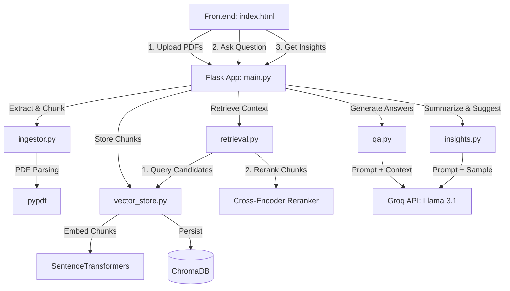

# DocIntel — Intelligent PDF Q&A & Insight Generator

DocIntel is a document intelligence system built for the N-ERGY take-home assignment. Users upload PDFs, ask natural language questions, and get answers with inline, clickable citations back to the exact source document and page. It also surfaces cross-document insights as a bonus feature.

## Optimization choice: accuracy over latency

This system is optimized for **accuracy**, not latency. Someone querying a document intelligence system wants a correct, verifiable answer — a fast wrong answer is worse than a slightly slower correct one, especially when citations are expected to be trustworthy. This choice shaped several decisions downstream:

- Sentence-boundary-aware chunking, which costs more to compute than naive fixed-size splitting but preserves semantic coherence within each chunk.
- Two-stage retrieval (vector search + cross-encoder reranking) instead of trusting raw embedding similarity alone — reranking adds latency but materially improves which chunks actually reach the LLM.
- A distance threshold filter that intentionally returns "not found" rather than forcing an answer from weak matches.
- Inline citations on every claim, so answers are independently auditable rather than just plausible-sounding.

## Architecture



### Backend
- **backend/main.py** — Flask entrypoint implementing `/api/upload`, `/api/query`, `/api/insights`, `/api/status`, `/api/reset`, and serving the frontend.
- **backend/ingestor.py** — Parses PDF content page-by-page using `pypdf` and partitions text into overlapping snippets using a sliding-window chunker that snaps to sentence boundaries (`_split_into_windows`).
- **backend/vector_store.py** — Integrates ChromaDB to store text chunks with local semantic embeddings via `sentence-transformers` (`all-MiniLM-L6-v2`). Pulls a wider candidate pool (top 20) to feed the reranking stage.
- **backend/retrieval.py** — Two-stage retrieval: a distance threshold pre-filter on initial vector matches, then reranking via a local cross-encoder (`cross-encoder/ms-marco-MiniLM-L-6-v2`) to sort by true relevance and return the top 5.
- **backend/qa.py** — Builds prompts from retrieved snippets, instructs the LLM to emit inline citation markers (`[1]`, `[2]`), and calls the Groq API (`llama-3.1-8b-instant`). Returns structured sources alongside the answer.
- **backend/insights.py** — Samples indexed chunks and asks the LLM for cross-document themes and follow-up questions (bonus feature).
- **frontend/index.html** — Single-page dashboard with dark/glassmorphic styling, live indexing stats, upload + query consoles, and interactive citation badges that scroll to and highlight the matching source.

## Key design decisions

- **Local embeddings, cloud generation.** Embedding locally with `sentence-transformers` avoids per-chunk API cost and latency during ingestion. The one unavoidable network dependency is generation itself.
- **Two-stage retrieval over single-pass top-k.** Pulling 20 candidates and reranking to 5 costs extra compute but directly serves the accuracy-first goal — embedding similarity alone is a weaker relevance signal than a cross-encoder scoring the actual (question, chunk) pair.
- **Metadata lives in ChromaDB rather than a separate database.** At this scale (1–50 PDFs), a second storage layer isn't justified yet. This is one of the first things I'd change at higher scale (see below).
- **Inline citations over a flat citation list.** Markers embedded directly in the answer text make it clear which specific claim each source supports, rather than leaving the reader to guess which citation backs which sentence.

## Edge cases handled

- **Empty / image-only PDFs** — detected when extracted text is empty across all pages; returned as `status: "empty"` instead of silently indexing nothing.
- **Irrelevant queries** — the distance threshold filters out weak matches before reranking even runs, and `qa.py` returns an explicit "couldn't find relevant information" response instead of fabricating an answer.
- **No documents uploaded yet** — `/api/query` and `/api/insights` check `has_documents()` first and return a clear error.
- **Over the file limit** — `/api/upload` rejects batches over 50 files with a 400 and explicit message.
- **Non-PDF files in a batch** — silently skipped rather than failing the whole upload.

## What would break at scale (10k+ documents)

- **ChromaDB's local persistent client is single-node and in-process.** At 10k+ documents (likely hundreds of thousands of chunks), query latency and index build time would degrade, and concurrent uploads would contend for the same underlying index file. I'd move to a dedicated vector DB service (Weaviate, Qdrant, or Pinecone) with distributed indexing.
- **Synchronous ingestion.** `/api/upload` currently blocks until every PDF is parsed, chunked, and embedded. At scale this would time out requests and block Flask's worker. I'd move ingestion to a background job queue (Celery + Redis) and have upload return immediately with a `processing` status.
- **Reranking cost grows with candidate pool size.** Cross-encoder scoring is more expensive per-comparison than vector search. At scale, retrieving 20 candidates per query across a much larger index may need a cheaper first-pass filter (e.g. BM25 or a smaller embedding model) before the cross-encoder stage.
- **In-memory local embedding and reranking models.** Both load into the Flask process. Under concurrent load this becomes a bottleneck; a dedicated, possibly GPU-backed embedding/reranking service would be needed.
- **No table/formula-aware chunking.** Documents with dense tables get chunked as plain text right now, which can fragment tabular data mid-row. At scale, structure-aware parsing (e.g. Unstructured.io, or table-detection libraries) would be necessary.

## What I'd improve with more time

- Detect and separately handle tables and chemical-formula-style notation during chunking instead of treating all PDF text uniformly.
- Move from synchronous to async ingestion with a status-polling endpoint.
- Add a proper relational metadata layer (document status, page counts, timestamps) instead of overloading ChromaDB's metadata fields.
- Add a cheaper first-pass filter ahead of the cross-encoder stage to keep reranking cost bounded as the index grows.
- Add automated tests for the chunking boundary logic and the edge cases listed above.

## Features

1. **Multi-file PDF ingest** — processes multiple PDFs per upload, extracting and chunking text automatically.
2. **Local embedding generation** — `all-MiniLM-L6-v2`, no API key required for embeddings.
3. **Two-stage retrieval (RAG)** — top 20 vector candidates, reranked to top 5 via cross-encoder.
4. **Interactive inline citations** — `[1]`, `[2]` markers in the answer are clickable, scrolling to and highlighting the matching source.
5. **Contextual insights** — cross-document themes and follow-up question suggestions.
6. **Live stats & reset** — indexed chunk count, and a one-click index/upload reset.

## Setup

### Prerequisites
- Python 3.8+
- A Groq Cloud API key ([console.groq.com](https://console.groq.com/keys))

### Install
```bash
git clone https://github.com/ammargit93/DocIntel
cd DocIntel
python -m venv venv
# Windows: .\venv\Scripts\Activate.ps1
source venv/bin/activate
pip install -r requirements.txt
```

### Configure
Create a `.env` file in the project root:
```env
GROQ_API_KEY=your_actual_groq_api_key_here
```

### Run
```bash
python backend/main.py
```
Then open [http://localhost:5050](http://localhost:5050).

## Usage

1. **Upload documents** — choose one or more PDFs and click Upload; wait for the chunk count to update.
2. **Ask a question** — type a natural language question and hit Ask Assistant.
3. **Inspect citations** — click inline `[1]`, `[2]` badges in the answer; the sources pane scrolls to and highlights the matching excerpt, filename, and page.
4. **Get insights** — view cross-document themes and suggested follow-up questions.
5. **Reset** — clear the index and uploaded files for a clean slate.
