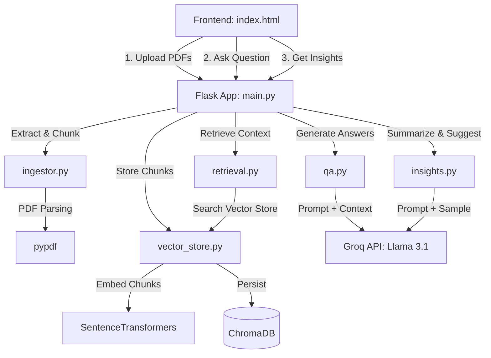

# DocIntel - Intelligent PDF Q&A & Insight Generator

DocIntel is a lightweight, local-first document intelligence platform. Users can upload multiple PDF documents, store and search them semantically using a local vector database, and perform interactive Q&A or generate automated insights using the Groq Llama 3.1 API.

The system features a beautiful dark-mode web interface with glassmorphic styling, live indexing status, real-time database stats, and direct citation links to source files and page numbers.

---

## 🏗️ Architecture & Component Overview

The application is structured into a clean backend-frontend separation:



### Backend Codebase
- **backend/main.py**: The entrypoint Flask server that implements the API endpoints (`/api/upload`, `/api/query`, `/api/insights`, `/api/status`, `/api/reset`) and hosts the static dashboard frontend.
- **backend/ingestor.py**: Parses PDF content page-by-page using `pypdf` and partitions text into overlapping snippets using a sliding-window chunker snapping to sentence boundaries (`_split_into_windows`).
- **backend/vector_store.py**: Integrates ChromaDB to store text chunks along with local semantic embeddings calculated via `sentence-transformers` (`all-MiniLM-L6-v2`).
- **backend/retrieval.py**: Fetches top relevant context snippets matching a user's question, applying distance threshold filtering to filter out irrelevant metadata.
- **backend/qa.py**: Builds system prompts embedding retrieving snippets, formats reference sources, and executes Groq cloud inference (`llama-3.1-8b-instant`).
- **backend/insights.py**: Samples document store records to feed Groq with semantic snippets, returning global key takeaways and follow-up prompts.

### Frontend
- **frontend/index.html**: Single-page dashboard application built with modern dark aesthetics, incorporating interactive components, dynamic document uploads, search consoles, markdown rendering, and status meters.

---

## ⚡ Features

1. **Multi-File PDF Ingest**: Process multiple PDFs in parallel. The backend automatically extracts text and creates optimized semantic chunks.
2. **Local Embedding Generation**: Computes embeddings locally using the lightweight and fast `all-MiniLM-L6-v2` transformer model (no API key required for embeddings).
3. **Retrieval-Augmented Generation (RAG)**: Combines local vector retrieval with Groq cloud LLM compilation to answer document questions accurately.
4. **Source Citations**: Answers return specific citations linking back to the precise PDF source file and page index.
5. **Contextual Insights**: Analyses document snapshots to suggest themes and subsequent follow-up search questions.
6. **Live Stats & Resets**: Visualizes current indexed chunk count and allows clearing the index for a clean slate.

---

## 🚀 Getting Started

### 📋 Prerequisites
- Python 3.8 or higher installed.
- A **Groq Cloud API Key** (you can get one free at [console.groq.com](https://console.groq.com/keys)).

### 🔧 Installation Steps

1. **Clone or Navigate to the Directory**:
   ```bash
   #Clone the repository
   git clone https://github.com/ammargit93/DocIntel
   cd DocIntel
   ```

2. **Set up a Virtual Environment**:
   ```bash
   python -m venv venv
   # On Windows (PowerShell):
   .\venv\Scripts\Activate.ps1
   # On macOS/Linux:
   source venv/bin/activate
   ```

3. **Install Dependencies**:
   ```bash
   pip install -r requirements.txt
   ```

4. **Configure Environment Variables**:
   Create a `.env` file in the project root directory (or edit the existing one) to specify your Groq credentials:
   ```env
   GROQ_API_KEY=your_actual_groq_api_key_here
   ```

---

## 🏃 Running the Application

1. Ensure your virtual environment is active and the `GROQ_API_KEY` is loaded.
2. Run the Flask server:
   ```bash
   python backend/main.py
   ```
3. Open your browser and navigate to:
   [http://localhost:5050](http://localhost:5050)

---

## 💡 Usage Workflow

1. **Upload Documents**: Under the upload section, choose one or more `.pdf` files and click **Upload**. Wait for ingestion to finish and update the chunk dashboard count.
2. **Search / Query**: Type a question into the text console (e.g., *"What is the main finding of the report?"*) and hit **Ask Assistant**.
3. **Inspect Citations**: Expand the citation accordion under the generated answer to view exactly which pages of the PDF the model referenced.
4. **Get Global Insights**: Click **Get Insights** (or wait for automatic loading) to see key themes and prompt ideas parsed across the document corpus.
5. **Reset Database**: Hit the red **Reset System** button at the bottom of the page to delete all cached collections and clear the `uploads/` directory files.

